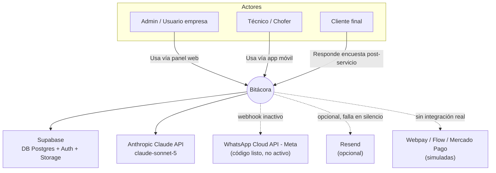
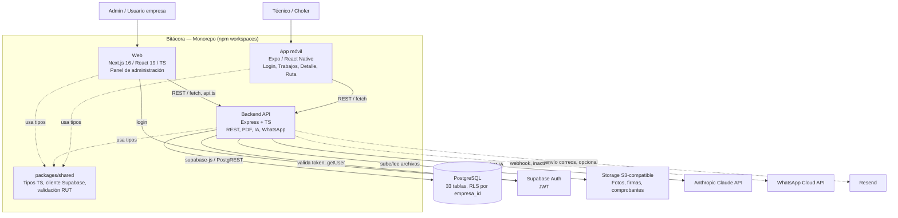

# Bitácora

Plataforma de gestión operativa, financiera y de servicio al cliente para empresas de
servicios en terreno (transporte, mantención, instalación, estética, y rubros similares).
Centraliza agenda, órdenes de servicio digitales, cotizaciones y cobros, flota, inventario,
informes con IA, y un asistente conversacional — todo con branding y theming personalizado
por empresa.

> Proyecto multi-tenant: cada empresa cliente (`empresas`) opera de forma aislada sobre la
> misma base de datos, con Row Level Security de Postgres.

---

## Tabla de contenidos

- [Stack técnico](#stack-técnico)
- [Arquitectura](#arquitectura)
- [Estructura del repositorio](#estructura-del-repositorio)
- [Módulos principales](#módulos-principales)
- [Modelo de datos](#modelo-de-datos)
- [Desarrollo local](#desarrollo-local)
- [Variables de entorno](#variables-de-entorno)
- [Despliegue](#despliegue)
- [Roadmap / pendientes conocidos](#roadmap--pendientes-conocidos)

---

## Stack técnico

| Capa | Tecnología | Versión |
|---|---|---|
| Frontend web | Next.js (App Router) | 16.3.2 |
| Frontend web | React | 19.2.8 |
| Frontend web | TypeScript | ^5 |
| Estilos | Tailwind CSS | v4 |
| Gráficos | Recharts | ^3.10 |
| Mapas | Leaflet | ^1.9 |
| Backend | Node.js + Express | Express ^4.19, TS ^5.5 |
| Base de datos | PostgreSQL, gestionado por Supabase | — |
| ORM | Ninguno — `@supabase/supabase-js` (PostgREST) directo, tipado a mano | ^2.45 |
| Autenticación | Supabase Auth (JWT) | — |
| Multi-tenant | RLS de Postgres (`empresa_id = empresa_actual()`) + filtro explícito en backend | — |
| Mobile | Expo + React Native | Expo ~57, RN 0.86 |
| IA | Anthropic Claude API (`@anthropic-ai/sdk`), modelo `claude-sonnet-5` | ^0.68 |
| Storage de archivos | Capa propia sobre `@aws-sdk/client-s3`, apuntando al S3 de Supabase Storage | — |
| PDF | `pdfkit` (generación programática) | ^0.20 |
| Email | Resend (opcional) | — |

---

## Arquitectura

### Diagrama de contexto

Vista de más alto nivel: quiénes usan el sistema y con qué servicios externos interactúa.



### Diagrama de contenedores

Un nivel más de detalle: las piezas desplegables del monorepo y cómo se comunican.



### Decisiones de arquitectura ya tomadas

- **Sin ORM:** `supabase-js` directo + tipado manual centralizado en `packages/shared/src/types.ts`, en vez de Prisma/Drizzle.
- **Sin librería de componentes UI:** design system propio sobre Tailwind v4, para control total del theming por-empresa.
- **PDF con `pdfkit` puro**, sin motor de plantillas HTML→PDF (Puppeteer, react-pdf) — más liviano, sin navegador headless en el backend.
- **Bot de WhatsApp sobre la Cloud API de Meta directa**, no un BSP intermediario (Twilio/360dialog).
- **RLS de doble capa:** políticas a nivel de Postgres + filtro explícito por `empresa_id` en cada query del backend.

---

## Estructura del repositorio

```
bitacora/
├── ENCARGO-claude-code.txt   ← prompt maestro original del proyecto
├── web/                       Next.js — panel de administración
│   └── src/
│       ├── app/
│       │   ├── dashboard/     ~20 módulos, cada carpeta = sección del sidebar
│       │   ├── login/, registro/, invitacion/, onboarding/
│       │   └── encuesta/      única ruta pública (sin auth)
│       ├── components/        DashboardShell, ui.tsx, AsistenteChat, charts/
│       └── lib/                api.ts, formatMoneda.ts, periodo.ts
├── backend/                   Express + TypeScript — API REST
│   └── src/
│       ├── routes/             29 archivos, un router por recurso
│       ├── server.ts           monta rutas + middlewares globales
│       ├── auth.ts, empresa.ts  valida JWT, resuelve empresa_id
│       ├── claude.ts           cliente Anthropic + prompts de IA
│       ├── whatsapp.ts         bot de WhatsApp
│       ├── storage.ts          capa S3
│       └── generarPdfOS.ts, generarPdfInforme.ts
├── mobile/                     Expo — app para choferes/técnicos (parcial)
│   └── screens/                 Login, Trabajos, TrabajoDetalle, Ruta
├── packages/shared/            tipos compartidos entre los 3 apps
│   └── src/
│       ├── types.ts             fuente de verdad de cada tabla (Row types)
│       ├── supabase.ts          factory del cliente supabase-js tipado
│       └── rut.ts               validación/formato de RUT chileno
└── supabase/
    ├── migrations/              26 archivos SQL numerados
    └── fase2-referencia/        Terraform + RLS portable + CI (referencia, no activo)
```

---

## Módulos principales

| Módulo | Estado |
|---|---|
| Agenda | ✅ Implementado (vista Mes/Día) |
| Órdenes de Servicio digitales | ✅ Checklist, fotos con análisis IA, firma, folio, PDF |
| Financiero | ✅ Cotizaciones, Gastos, Cobros (link de pago **simulado**) |
| Informes | ✅ 9 pestañas de analítica + export CSV/PDF |
| Informe con IA | ✅ Estructurado, libre, personalizado |
| Asistente conversacional | ✅ Chat flotante con tool-use de Claude |
| Registros | ✅ Clientes, Equipos, Catálogo, Inventario, Proveedores |
| Flota | ✅ Colaboradores, Vehículos, Documentos por vencer |
| Viajes (transporte) | ✅ Guías, km, IVA, agrupación en factura |
| Bot de WhatsApp | ⚠️ Código completo, sin credenciales de Meta configuradas |
| App móvil | ⚠️ Parcial — falta check-in/out geolocalizado |
| Pagos (Webpay/Flow/Mercado Pago) | ❌ Solo simulado |
| Facturación electrónica (SII) | ❌ No implementado — requiere certificación como emisor DTE |
| Google Document AI | ❌ Placeholder de UI, sin lógica de backend |

---

## Modelo de datos

33 tablas, 63 foreign keys, todas con `empresa_id` y RLS `empresa_id = empresa_actual()`,
salvo `empresas` misma y `whatsapp_mensajes_procesados` (ledger de idempotencia sin dueño).

Ver diagrama entidad-relación completo en [`docs/ERD_Bitacora.mermaid`](./docs/ERD_Bitacora.mermaid)
(o el archivo `.mermaid` correspondiente en este repo).

Dominios principales: Núcleo/tenancy, Clientes y activos, Trabajo genérico (OS/OT),
Transporte, Catálogo/inventario, Financiero, Rutas, IA/informes, Config/personalización,
Bot WhatsApp.

---

## Desarrollo local

```bash
# Instalar dependencias (monorepo, npm workspaces)
npm install

# Configurar variables de entorno (ver sección siguiente)
cp .env.example .env

# Levantar el backend
cd backend && npm run dev

# Levantar el frontend web
cd web && npm run dev

# Levantar la app móvil (Expo)
cd mobile && npx expo start
```

> Requiere un proyecto Supabase propio (gratis para desarrollo) con las migraciones de
> `supabase/migrations/` aplicadas en orden.

---

## Variables de entorno

No se documentan valores reales aquí — solo los nombres. Cada uno vive en su `.env`
correspondiente (`backend/.env`, `web/.env.local`).

| Variable | Dónde | Requerida |
|---|---|---|
| `SUPABASE_URL` | backend, web | Sí |
| `SUPABASE_SERVICE_ROLE_KEY` | backend | Sí (nunca exponer al frontend) |
| `ANTHROPIC_API_KEY` | backend | Sí |
| `STORAGE_ENDPOINT` / `STORAGE_REGION` / `STORAGE_ACCESS_KEY` / `STORAGE_SECRET_KEY` / `STORAGE_BUCKET` | backend | Sí |
| `WHATSAPP_ACCESS_TOKEN` / `WHATSAPP_PHONE_NUMBER_ID` / `WHATSAPP_VERIFY_TOKEN` / `WHATSAPP_APP_SECRET` | backend | No (bot inactivo sin esto) |
| `RESEND_API_KEY` / `RESEND_FROM_EMAIL` | backend | No (falla en silencio si falta, salvo invitación de colaboradores — ver Issues conocidos) |
| `USUARIOS_MFA_ENCRYPTION_KEY` | backend | Sí (cifra el secreto TOTP del 2FA de usuarios; sin ella el backend no arranca) |
| `ALLOWED_ORIGINS` | backend | No (sin configurar, CORS solo acepta `http://localhost:3000`) |

---

## Despliegue

| Pieza | Proveedor |
|---|---|
| Web (Next.js) | Vercel |
| Backend (Express, Docker) | Render |
| DB / Auth / Storage | Supabase (proyecto de producción separado del de desarrollo) |
| Dominio, DNS, WAF | Cloudflare |

Checklist de salida a producción (seguridad): ver documento interno de plan de lanzamiento
(ambientes separados, RLS auditado, secretos rotados, `helmet` + rate limiting, 2FA para
Admin, backups probados, cumplimiento Ley 21.719).

---

## Roadmap / pendientes conocidos

- CI/CD (GitHub Actions) — no implementado aún.
- Supabase Realtime — mencionado en el diseño original, nunca usado en el código actual.
- Migración a GCP (Fase 2) — artefactos de referencia existen en `supabase/fase2-referencia/`, sin activar.
- Check-in/out geolocalizado en la app móvil.
- Integración real de pasarela de pago (hoy simulada).
- Certificación como emisor de DTE ante el SII.
- Activación del bot de WhatsApp (requiere que el cliente configure su cuenta de Meta Business).

---

## Convenciones del proyecto

- Todo el código (variables, comentarios, nombres de tabla/columna) está en **español**.
- Los tipos "Row" en `types.ts` son `type`, nunca `interface`.
- Cada router de backend sigue el patrón `ah<RequestConEmpresa>(async (req, res) => {...})`, montado con `requiereAuth, requiereEmpresa`.
- `.update(objeto)` de supabase-js siempre se tipa como `Partial<TheRowType>`.
